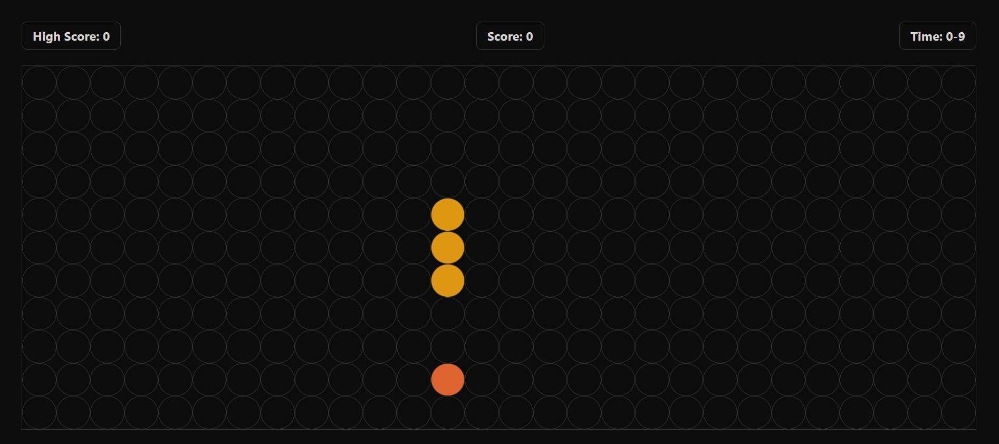

# 🐍 Snake Game

A simple Snake Game built using **HTML, CSS, and JavaScript**.

This project was created to practice JavaScript fundamentals and understand how HTML, CSS, and JavaScript work together to build an interactive web application.

---

## 🎮 Live Demo

👉 **[Play the Snake Game](https://sameerkumar-on1.github.io/snake-game/)**

---

## 📸 Preview



---

## ✨ Features

- 🎮 Control the snake using the arrow keys
- 🍎 Randomly generated food
- 📈 Score system
- 🏆 High score saved using `localStorage`
- ⏱️ Game timer
- 💀 Game Over screen
- 🔄 Restart the game
- 🎨 Simple dark-themed interface
- 🖥️ Flexible game board layout

---

## 🛠️ Technologies Used

- **HTML5** – Structure of the game
- **CSS3** – Styling and layout
- **JavaScript** – Game logic and interaction
- **LocalStorage** – Saving the high score

---

## 🎯 How to Play

1. Click the **Start Game** button.
2. Use the arrow keys to control the snake:
   - ⬆️ Arrow Up
   - ⬇️ Arrow Down
   - ⬅️ Arrow Left
   - ➡️ Arrow Right
3. Move the snake toward the food.
4. Each time the snake eats the food, your score increases.
5. Avoid hitting the boundaries of the game board.
6. Try to achieve the highest score possible!

---

## 📚 Purpose of the Project

This project is part of my ongoing practice in **web development and JavaScript**.

It helped me practice:

- DOM manipulation
- Event handling
- Timers
- Arrays
- Objects
- Game logic
- Browser Local Storage
- Keyboard input
- Dynamic HTML elements

---

## 📂 Project Structure

```text
snake-game/
│
├── index.html
├── style.css
├── Script.js
├── preview.png
└── README.md
```

---

## 🚀 Future Improvements

- [ ] Add collision detection with the snake's own body
- [ ] Prevent the snake from immediately reversing direction
- [ ] Add difficulty levels
- [ ] Add mobile controls
- [ ] Add sound effects
- [ ] Improve animations and UI
- [ ] Add a pause button

---

## 👨‍💻 Author

**Sameer Kumar**

GitHub: [@sameerkumar-on1](https://github.com/sameerkumar-on1)
